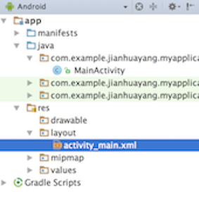

# Android programming @ Coventry University


Hello! Welcome to Android activities at Coventry University expereince day! 

In this 50 minutes session you'll have a little taste of what our students do at Coventry. In particular, what you see right now is a (much) simplified version of the material we use for our undergraduate module 'Mobile Applications Development'. If you're curious, the full set of material can be found here:

* [Android App Development](https://github.com/covcom/388COM)
* [iOS App Development](https://github.com/covcom/387COM)

## A little background

First of all, let's ask a question - what is Android? Well, the answer depends on who you ask. There're several different levels to define Android: on the very deep level, it's a Linux operating system that controls a bunch of hardware and sensors. This is the same as any other operating systems such as Mac/Windows; on the very superficial level, Android are devices such as Samsung Galaxy or HTC; For us, Android developers, Android is an application runtime that we can develop mobile apps.

Android has been around for a while, hence we have different versions. For each version of Android, we have a 'sweet' codename with the latest being 'Lollipop' and 'Marshmallow', which are not shown in the picture below.


What do I need to become an Android developer? The short answer is you'll need the Java language and Android Studio, which is an IDE (integrated development environment). And of course a smart brain! Some will ask, do I have to have an Android device to be a developer? No, you don't. Even though last year our students were given Moto 360s (Moto E2s the year before, all free of charge), you don't have to own an Android device.

## A step-by-step tutorial

In this section you have 2 small tasks to achieve, each of which will last about 15 minutes. If you get stuck at any time, put your hands up and someone will help you. I assume you all know something about programming. If not, let one of us know. 

### Task 1: start a project from template

Follow the steps below to create and run your first Android app:

1. Click the Start menu and navigate to Android Studio, click on it to start the application.
    
    
    
    If you see the following window, choose 'I do not have...' and click OK.
    
    
    
2. Then click on 'Start a new Android Studio project'.
    
    
    
2. In the window that pops up, give it a name such as 'Hello Android'. In 'Project location' settings select your desired location.
    
    
        
3. Next screen asks you to choose minimum SDK. The default value should do. If you want to know more about this minimum SDK, click on 'Help me choose' and read the info that comes up. 
    
    
    
4. Keep clicking Next until you see Finish. Then click Finish to create your first Android project. Your screen should look similar to below:
     
    
    
    If this is the first time Android Studio is being run on the computer, this step might take a while. You need to wait until the task bar finishes to move to the next step.
    
    
    
4. You'll now see an error message 'This version of the rending library is more recent...' 
    
    
    
    To get around this, you will need to open the styles.xml file by navigating to app ==> res ==> values ==> styles.xml in the Android tool window and double click on it
    
    
    
    Now the file will open in the main editor. Change the text from 
    
    ```xml
    Theme.AppCompat.Light.DarkActionBar
    ```
    
    to
    
    ```xml
    Base.Theme.AppCompat.Light.DarkActionBar
    ```
5. Go back to activity_main.xml and switch the Preview Version to API22: Android 5.1.1. The error  should now go away.
    
    
    
5. You're ready to run the app you just created. The reason you don't have to own an Android device to become a developer is that you can run an Android simulator. That is, a computer programme that simulates the behavior of a real Android phone or tablet. Now let's make sure you have the default AVD installed. 
    
    Click Tools ==> Android ==> AVD Manager to show the AVD Manager
    
    
    
    You should see something similar to below
    
    
    
    Click 'Create Virtual Device' button and use all default options to create a new one. Once created, click the little green triangle to run it. You might have to wait a while for it to load.
    
    
    
    On some of the machines, this will give you an error 'Cannot launch AVD in emulator'. If this happens to you, we have an Nexus 7 tablet to run your app.
5. Now click Run ==> Run 'app' to run the app you just created. In the window that pops up, click 'Launch emulator' and choose the desired AVD if you have more than one. BTW, you should only have 1 AVD running, otherwise the system will be rather slow. You will see HelloAndroid running in AVD similar to the one below.
    
    
    
### Task 2: customize layouts and run on a real device

Follow steps below to create another app:

1. In Android Studio, click 'Start a new Android Studio project', and give it a name such as 'Hello Me'.
2. In 'Project location' settings select your desired location. 
3. Use all default settings until you see Finish. These steps are the same as before, and should become the *de facto* standard.
4. Double click to open 'activity_main.xml' if it’s not opened already.
    
    
    
5. Under default settings the 'Text' view will show. Click 'Preview' tool window to the right edge of the IDE to bring up the Preview window. Your whole workbench should look like below.
    
    
    
6. Delete texts contained between '<span>&lt;</span>TextView' and the closing '/>'. You'll see that the words 'Hello World' disappeared on the preview window.
    
    > See the little camera in the Preview window menu bar. Guess what it does?
    
7. Click the 'Design' tab to switch to the design view. Locate and drag the following four widgets from Palette to the layout one by one: Plain TextView, SmallText, PersonName, Button. Your Component Tree should look at the following
    
    
    
8. At this point, if you click one of the widgets you just dragged onto the graphical layout, you can change its properties using the Properties window. Try to change some of the properties to see the effects, and we’ll change them back later.
    
    > The graphical layout in the design view is not to be confused with preview in the text view. The preview tool is more powerful for example sometimes it gives error message 'Rendering Problems.
    
9. Click the 'Text' tab to go back to the text view. Manually edit the xml file, make it look like the following
    
    ```xml
     <TextView
        android:id="@+id/textViewDisplay"
        android:layout_width="wrap_content"
        android:layout_height="wrap_content"
        android:text="Hello World"
        android:textSize="24sp" />
        
    <TextView
        android:id="@+id/textView1"
        android:layout_width="wrap_content"
        android:layout_height="wrap_content"
        android:layout_alignLeft="@id/textViewDisplay"
        android:layout_below="@id/textViewDisplay"
        android:layout_marginLeft="19dp"
        android:layout_marginTop="56dp"
        android:text="Name:"
        android:textAppearance="?android:attr/textAppearanceSmall" />
        
    <EditText
        android:id="@+id/editText"
        android:layout_width="wrap_content"
        android:layout_height="wrap_content"
        android:layout_alignBaseline="@id/textView1"
        android:layout_alignBottom="@id/textView1"
        android:layout_marginLeft="36dp"
        android:layout_toRightOf="@id/textView1"
        android:ems="10"
        android:inputType="textPersonName" />
        
    <Button
        android:id="@+id/button"
        android:layout_width="wrap_content"
        android:layout_height="wrap_content"
        android:layout_below="@+id/editText"
        android:layout_centerHorizontal="true"
        android:layout_marginTop="22dp"
        android:text="Display" />
    ```
    
10. Open MainActivity.java, create a method called onButtonClick that looks like below:
    
    ```java
     public void onButtonClick(View view) {
        EditText editName = (EditText) findViewById(R.id.editText);
        TextView textDisplay = (TextView) findViewById(R.id.textViewDisplay);
        String nameToDisplay = editName.getText().toString();
        textDisplay.setText("Hello " + nameToDisplay);
    }
    ```
    Note when you first use a class that hasn't been imported, Android Studio will show the class name in red. You'll need to import the class. The keyboard shortcut to do the importing is 'alt' + 'enter'.
    
11. Go back to the layout file activity_main.xml you modified earlier, change the Button tag to include the following attribute:
    
    ```xml
    android:onClick="onButtonClick"
    ```
    > In order to create a method that responds to user clicks, the method needs to have a signature of 'public void doSomething(View view)'.
    
12. Now you need to ask one of our staff to connect Nexus 7 to your machine so you can run the app on a real device.

13. Run this app and select Nexus 7 as the target. Once you input something for example your name and click Display, your name will appear in the greeting message. 
    
    

## Our past students and projects

We're **one of the first** UK universities that offer courses in mobile app development. In fact, our past students have done some excellent work in the course and are very successful in their career. 

Here are some projects and apps our students developed for the module and also in their free time:


Swiftnotes is an Android app developed by Adrian Chifor. The app is available in [Play store](https://play.google.com/store/apps/details?id=com.moonpi.swiftnotes) and sourcecode for the app can be found [here](https://github.com/adrianchifor/Swiftnotes).


Squash Simulation is an Android app developed by Fabian Furger. Sourcecode for the app can be found [here](https://github.com/furgerf/Squash/tree/master/Squash%20Simulation). There's an introduction for this app on [YouTube](https://www.youtube.com/watch?v=4VqZXWbodaY).

**Have fun! Hope to see you soon!**